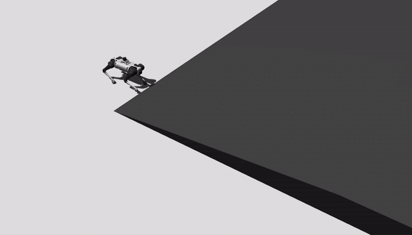
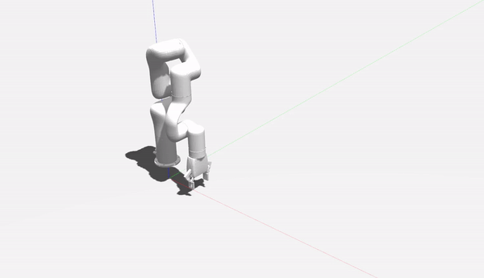
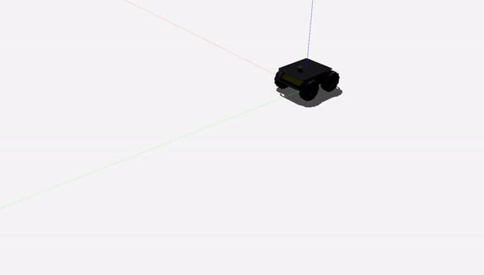

.. Property-Based Testing: Formalized Robotic Testing for Standard Compliance documentation master file, created by
   sphinx-quickstart on Sat Nov 19 17:13:21 2022.
   You can adapt this file completely to your liking, but it should at least
   contain the root `toctree` directive.

Property-Based Testing: Formalized Robotic Testing for Standard Compliance's documentation!
===========================================================================================

This is the documentation for the code used in the revised property-based testing framework.

.. important::

   The revised property-based testing framework can be found in the 
   `Github repository <https://github.com/SOHAIL1996/property_based_tester>`__.

Indices and tables
==================

* :ref:`genindex`
* :ref:`modindex`
.. * :ref:`search`

.. toctree::
   :maxdepth: 2
   :caption: Contents:   

.. include:: property_based_tester.configuration.rst
.. include:: property_based_tester.properties.rst
.. include:: property_based_tester.robot_test_definition_language.rst
.. include:: property_based_tester.robot_controllers.rst
.. include:: property_based_tester.scen_gen.rst
.. include:: property_based_tester.temporal_cache.rst